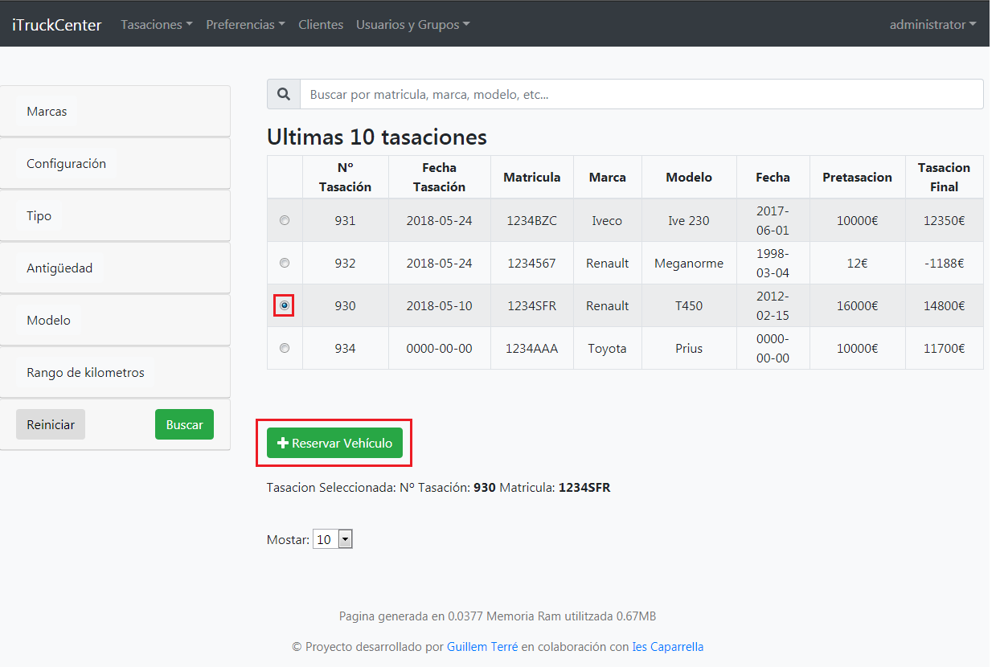
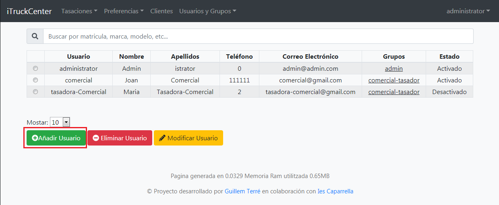

iTruckCenter
===============

*********************
Reservar un vehicle
*********************

Per reservar un vehicle hem d'anar a la pagina de consultar vehicles, podem accedir-hi fen clic a l'enllaç següent :

`Consultar
<http://itruckcenter.zapto.org/Credit/consultar>`_

Un cop aqui buscarem el vehicle que vulguem. Podem buscar-lo manualment o filtar-los amb el buscador integrat de l'esquerra.

El seleccionarem i farem clic al botò d' afegir reserva. Emplenarem les dades i instantaniament anirem a la pagina de reserves per confirmar que s'ha afegit. Si la volem modificar o borrar podem fer-ho amb el botons que tenim a la part inferior.

Es important saber que quan un vehicle es reservat cap altre usuari el podrà tornar a reservar, i que al esborrar la reserva el vehicle tornar a estar en stock inmediatament.

************************
Afegir usuari al sistema
************************

Per afegir un usuari al sistema haurem d'anar a la gestió d'usuaris o podem accedir-hi fent clic a l'enllaç següent :
`Administrar Usuaris 
<http://itruckcenter.zapto.org/Credit/admin/usuarios>`_.

Aquest apartat esta restringit al grup administrador, per tant només ells podràn gestionar els usuaris.

Quan haguem entrat veurem la llista dels ultims usuaris creats i un buscador per filtrar els resultats i així trobar l'usuari desitjat més rapidament.

En aquesta pagina buscarem el boto d'Afegir usuari. Si el cliquem s'obrira una nova finestra amb un formulari per entrar dades. Un cop entrades enviem el formulari i ja tindriem el nostre nou usuari creat.

.. image:: ./res/user_add.png